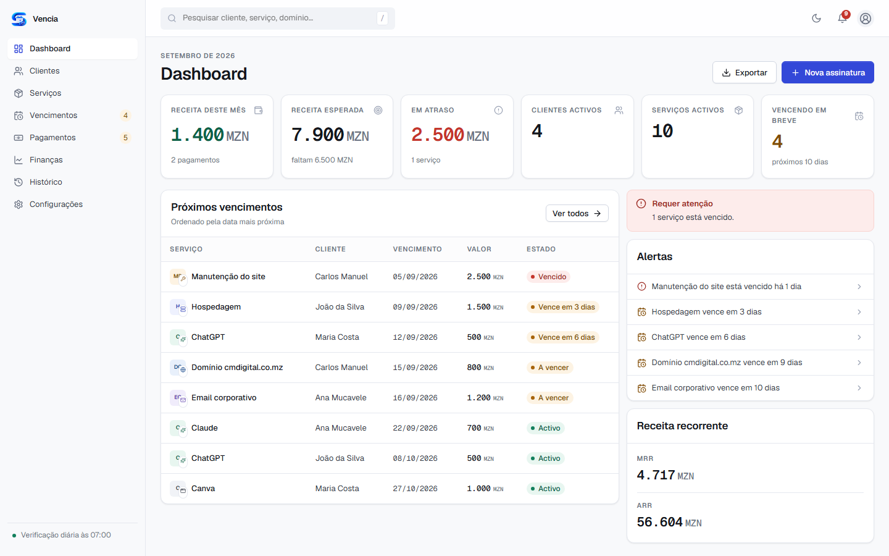
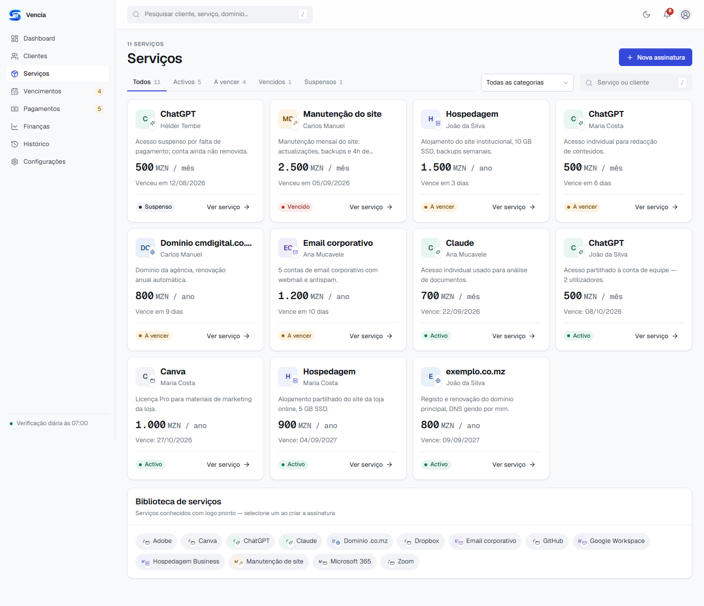
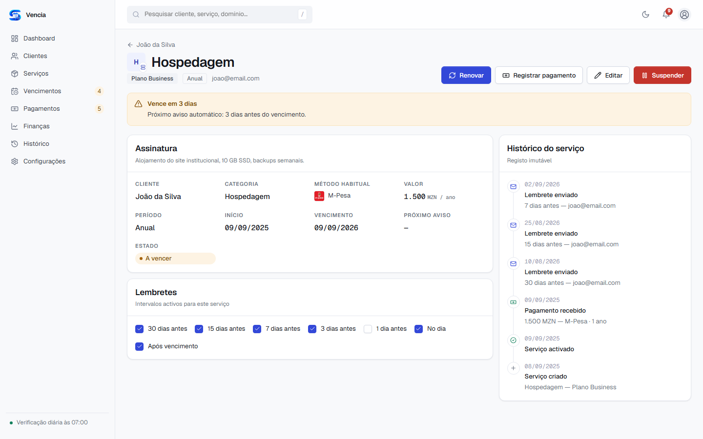
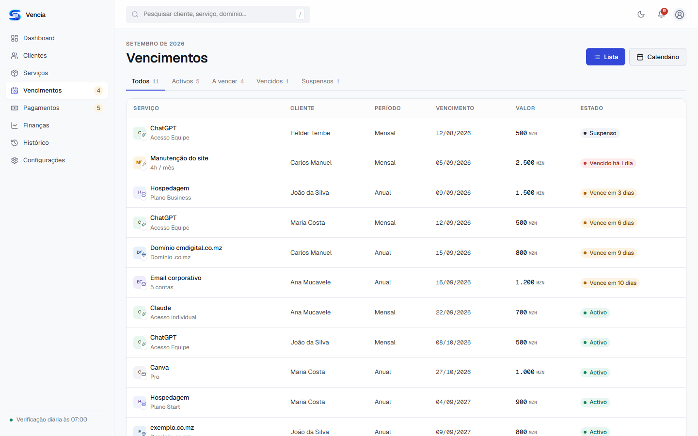
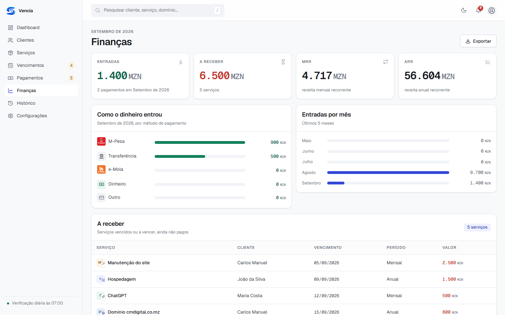
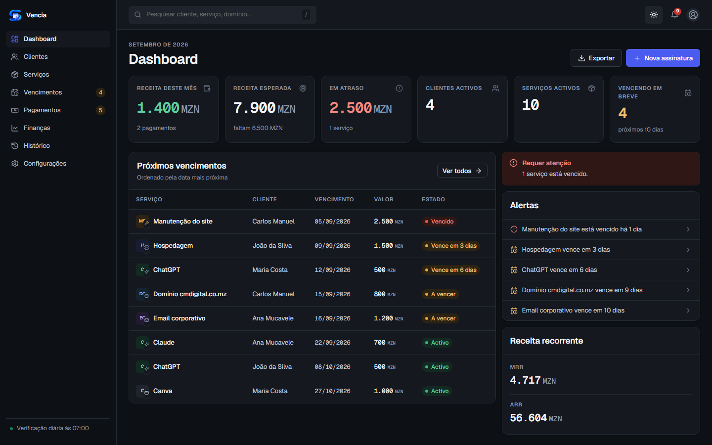

<div align="center">

# Vencia

**Gestão de clientes, serviços recorrentes, pagamentos e vencimentos — para quem vende assinaturas e não quer perder o fio à meada.**

Projecto pessoal, Moçambique · Laravel 13 + Livewire 4 · MZN · Português europeu

</div>

<br>



## Porque é que isto existe

Vendo domínios, hospedagem, acessos a ferramentas de IA e manutenção de sites a vários clientes, cada um com o seu ciclo de cobrança — mensal, anual, à medida. A folha de cálculo que usava para isto tinha deixado de chegar: não avisava ninguém de nada, não sabia dizer sem contar à mão quanto é que entrava por mês, e um esquecimento significava um cliente sem serviço ou uma cobrança em atraso sem eu dar por isso.

A Vencia nasceu para responder a quatro perguntas em segundos, sem abrir uma folha de cálculo: **quem me pagou, o que vence a seguir, quem está atrasado, o que preciso de suspender.** É uma ferramenta de administrador único — fui eu quem desenhou o fluxo, a pensar exactamente no meu próprio dia-a-dia — não um produto SaaS multi-empresa.

## Onde faz sentido usar isto

Se geres um número pequeno-a-médio de clientes com **cobranças recorrentes e datas de vencimento que importa não esquecer**, isto serve-te — freelancers e pequenas agências que revendem domínios/hospedagem/acessos a ferramentas, prestadores de manutenção mensal, quem cobra por assinatura em qualquer moeda (a app está feita para MZN e português europeu, mas a lógica é genérica). Não serve se precisares de multi-utilizador, cobrança automática por cartão, ou faturação fiscal formal — nada disso está aqui, de propósito.

## O que faz

| | |
|---|---|
| **Dashboard** | Receita do mês, receita esperada, quem está em atraso, MRR/ARR — de relance. |
| **Clientes & Serviços** | Cada cliente com os seus serviços; cada serviço com o seu ciclo, o seu método de pagamento habitual, o seu histórico. |
| **Renovar / Suspender** | Um clique regista o pagamento e avança o vencimento (a partir do vencimento anterior, nunca de hoje); suspender pára os lembretes sem apagar nada. |
| **Lembretes automáticos** | 30/15/7/3/1 dias antes, no dia, depois do vencimento — por email, ao cliente e a mim, todos os dias, sem intervenção manual. Nunca duplica um aviso. |
| **Vencimentos, Pagamentos, Finanças** | Lista e calendário de vencimentos; livro de pagamentos exportável; MRR/ARR e como o dinheiro entrou, por método. |
| **Histórico** | Registo de tudo o que aconteceu, nunca editado nem apagado. |

<table>
<tr><td width="50%"></td><td width="50%"></td></tr>
<tr><td width="50%"></td><td width="50%"></td></tr>
</table>

Tema claro e escuro, de origem:

<table>
<tr><td width="50%"></td><td width="50%"></td></tr>
</table>

## Stack

- **Laravel 13** + **Livewire 4** — componentes PHP, sem separar API/frontend.
- **MySQL**.
- **Blade**, com um kit de componentes de UI próprio em `resources/views/components/ui/` (botões, cartões, tabelas, badges de estado...) que reproduz um sistema de design feito de propósito para este projecto — ver `docs/design-original/`.
- **Sem build de JavaScript** — sem Vite, sem npm. O CSS é ficheiro estático simples. Só há JavaScript puro onde é mesmo preciso (tema claro/escuro, o menu de perfil), sem framework de frontend nenhum.

## Estrutura

```
app/
  Enums/             Estados e categorias como enums nativos do PHP (ServicoStatus, MetodoPagamento...)
  Models/             Cliente, Servico, Pagamento, Historico, Configuracao...
  Services/           ServicoStatusService (máquina de estados + renovação),
                       Totais (todos os números derivados do dashboard/finanças),
                       VerificacaoDiariaService (o motor de lembretes)
  Livewire/           Um componente por ecrã/diálogo, agrupado por área
                       (Clientes/, Servicos/, Pagamentos/, Financas/, Vencimentos/,
                       Historico/, Configuracoes/, Shared/)
  Mail/               Os dois templates de email (lembrete de vencimento, serviço terminado)
  Console/Commands/   vencia:verificar-vencimentos — o comando do job diário

resources/
  views/livewire/     Uma view Blade por componente Livewire acima
  views/components/ui/  O kit de UI (botões, tabelas, badges...) partilhado por todos os ecrãs
  css/                tokens/ (cores, tipografia, espaçamento) + components.css (estilos do kit de UI)

public/css/           Cópia estática de resources/css/ — é o que o browser carrega.
                       Atenção: esta cópia é MANUAL. Se editares resources/css/components.css,
                       copia também para public/css/components.css, senão a alteração não aparece.

docs/design-original/  O sistema de design e o protótipo que serviram de base para construir
                       esta aplicação. Já não é preciso para a app funcionar — fica só como
                       referência da ideia visual original.
docs/screenshots/      As imagens usadas neste README.

lang/pt_PT/            Traduções das mensagens de erro de formulário e de autenticação.

database/
  migrations/          Esquema da base de dados
  seeders/             Dados de demonstração (5 clientes, 11 serviços, pagamentos...) — fictícios,
                       com datas calculadas relativamente a "agora", nunca ficam desactualizadas.
```

## Como correr localmente

Pré-requisitos: PHP 8.3+, Composer, MySQL.

```bash
composer install
cp .env.example .env        # depois preencher DB_*, ADMIN_EMAIL, ADMIN_PASSWORD
php artisan key:generate
php artisan migrate --seed
php artisan storage:link
php artisan serve
```

Abrir `http://127.0.0.1:8000/login` e entrar com o `ADMIN_EMAIL`/`ADMIN_PASSWORD` definidos no `.env`. Não há registo — é uma aplicação de administrador único.

`php artisan migrate:fresh --seed --force` repõe os dados de demonstração fictícios (os que aparecem nas capturas acima) a qualquer momento.

## As regras de negócio que importa perceber antes de mexer no código

- **`Servico::dias`** (em `app/Models/Servico.php`) é sempre calculado, nunca guardado — dias até/desde o vencimento.
- **A máquina de estados** (`activo → a_vencer → vencido → suspenso | cancelado`) vive inteira em `App\Services\ServicoStatusService`. `avaliar()` decide o estado; `renovar()` e `suspender()` são as duas únicas formas de o mudar manualmente (nunca editar `status` directamente num formulário).
- **Renovar soma o período ao vencimento actual, não a hoje** — mensal 01/09 → 01/10 → 01/11, mesmo que hoje já seja dia 20. Isto está isolado em `ServicoStatusService::calcularProximoVencimento()`, reutilizado tanto pela pré-visualização do diálogo de Renovar como pela renovação real, para nunca desalinhar.
- **MRR/ARR e todos os totais do Dashboard/Finanças** vêm de `App\Services\Totais::calcular()` — um único sítio, nunca duplicar a query nem calcular à mão noutro ecrã.
- **`Historico` nunca é editado nem apagado** — o próprio modelo bloqueia isso (`boot()` lança excepção). É o registo de auditoria da aplicação.
- **Lembretes têm dois níveis**: um valor global por omissão (Configurações → Lembretes) e uma excepção por serviço (`ServicoLembreteConfig`, os checkboxes no ecrã do serviço). `ServicoStatusService::intervaloActivo()` é o único sítio que resolve qual dos dois vale para um serviço concreto.
- **O motor de lembretes nunca envia o mesmo aviso duas vezes** para o mesmo vencimento — controlado pela tabela `lembretes_enviados` (chave única `servico_id`+`intervalo`+`vencimento_referencia`).
- **Todo o email enviado a um cliente vai também, em cópia oculta, para o email da empresa** configurado em Configurações → Empresa (`Configuracao::emailBccAdmin()`) — para o admin ficar sempre a par, mesmo sem abrir a aplicação.

## Email

Por omissão `MAIL_MAILER=log` — os emails ficam registados em `storage/logs/laravel.log`, não saem de verdade. Para activar o envio real, preencher `MAIL_HOST`/`MAIL_USERNAME`/`MAIL_PASSWORD`/`MAIL_PORT` no `.env` com credenciais SMTP verdadeiras; não é preciso mudar nenhum código.

## Publicar online

Ver [`DEPLOY.md`](DEPLOY.md) — guia passo-a-passo para publicar num cPanel (requisitos, `.env` de produção, comandos, cron job, o que verificar se algo correr mal).

## Verificação diária de vencimentos

Ver [`OPERACOES.md`](OPERACOES.md) — como e onde agendar `php artisan vencia:verificar-vencimentos` (Task Scheduler no Windows, Cron Jobs num cPanel).

## O que ainda não existe

- Testes automatizados.
- Reatribuir um serviço a outro cliente, ou apagar entradas da biblioteca de serviços (só arquivar).
- Multi-utilizador / permissões — é deliberadamente uma aplicação de administrador único.

---

<sub>Construído com apoio do Claude Code — desenho original do sistema de identidade visual em <code>docs/design-original/</code>.</sub>
